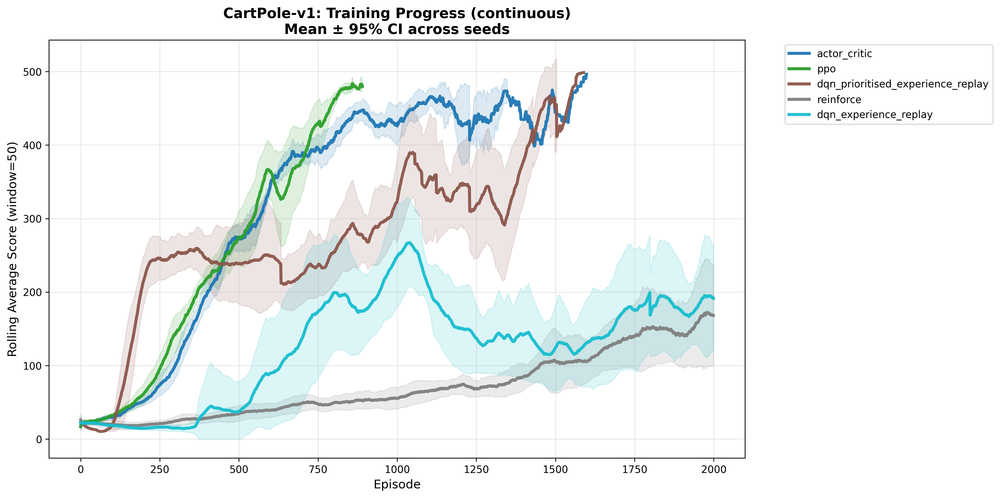
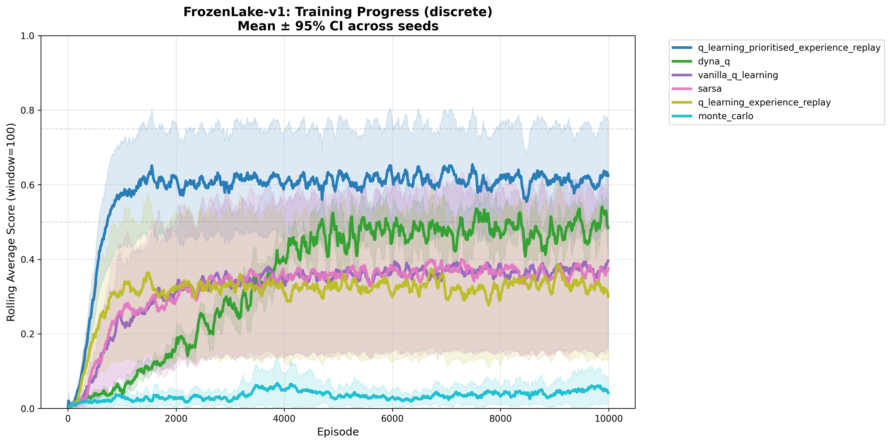

# Reinforcement Learning Playground

A modular codebase for experimenting with reinforcement learning agents on classic environments. Includes tabular and deep RL algorithms, benchmarking, hyperparameter tuning, and automated plotting.

## Features
- Tabular RL agents (Q-Learning, SARSA, Dyna-Q, Monte Carlo)
- Deep RL agents (DQN, PPO, Actor-Critic, REINFORCE)
- Experience replay and prioritized replay variants
- Benchmarking across multiple seeds
- Automated hyperparameter tuning (Optuna)
- Unified plotting for evaluation and training curves

CartPole-v1 (continuous):


FrozenLake-v1 (discrete):


## Repository Structure
- `src/` — RL agent implementations and utilities
    - `actor_critic.py`, `ppo.py`, `dqn_experience_replay.py`, `dqn_prioritised_experience_replay.py`, `reinforce.py`, `monte_carlo.py`, `dyna_q.py`, `q_learning_experience_replay.py`, `q_learning_prioritised_experience_replay.py`, `vanilla_q_learning.py`, `sarsa.py`, `random_agent.py`
    - `utils/` — environment setup, plotting, seeding, policy evaluation
- `main.py` — Run any agent interactively or with simulation
- `benchmark.py` — Run all agents across multiple seeds, save results
- `tune_hyperparameters.py` — Automated hyperparameter search (Optuna)
- `plot_all_results.py` — Generate comparison plots for all results
- `benchmark_results/` — CSVs and metadata for all experiments
- `plots/` — Generated PNG plots for evaluation and training curves
- `requirements.txt` — Python dependencies

## Installation & Dependency Management
This project uses [uv](https://github.com/astral-sh/uv) for fast, reliable Python dependency management. You can also use pip if preferred.

Install dependencies with uv:
```bash
uv pip install -r requirements.txt
```
Or with pip:
```bash
pip install -r requirements.txt
```

## Running Agents
To run an agent interactively:
```bash
python main.py <algorithm> <environment>
```
Example:
```bash
python main.py dqn_experience_replay CartPole-v1
```
Add `--simulate` to render the environment visually.

## Benchmarking
Run all compatible agents on an environment with multiple seeds:
```bash
python benchmark.py --environment CartPole-v1 --num-seeds 10
```
Results are saved in `benchmark_results/` as CSV files.

## Hyperparameter Tuning
Automated search for best hyperparameters using Optuna:
```bash
python tune_hyperparameters.py <algorithm> <environment> --n-trials 50
```

## Plotting Results
Generate all comparison plots:
```bash
python plot_all_results.py
```
Plots are saved in `plots/`.

## Available Algorithms
- Tabular: `vanilla_q_learning`, `q_learning_experience_replay`, `q_learning_prioritised_experience_replay`, `sarsa`, `dyna_q`, `monte_carlo`
- Deep: `dqn_experience_replay`, `dqn_prioritised_experience_replay`, `ppo`, `actor_critic`, `reinforce`

## License
MIT License
